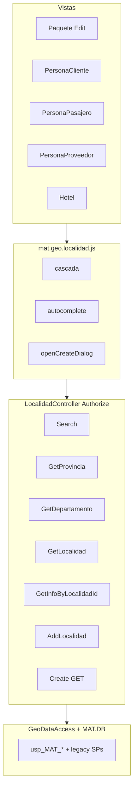

# Plan de implementación — Normalización de Localidad

**Fecha:** 2026-07-01  
**Depende de:** NetTiers F2 (GeoDataAccess + SPs `usp_MAT_*`) — debe estar publicado en BD  
**SPEC sugerido:** agregar épica P2 *Normalización UX Localidad* (tasks L1–L12 abajo)  
**Ejecutar en orden:** cada task depende de los anteriores salvo donde se indique

---

## 1. Objetivo

Unificar selección y alta de `dbo.Localidad` en toda la intranet MAT:

- **Una fachada HTTP:** `LocalidadController`
- **Una capa de datos:** `GeoDataAccess` (+ SPs en `MAT.DB`)
- **Un módulo JS:** `mat.geo.localidad.js`
- **Errores normalizados:** `ErrorUtil` en server; handlers `error` en client; sin `e.Message` al usuario

### Mismo catálogo, distintos roles (no cambiar schema)

| Caso de uso | Pantalla | Campo persistido | Patrón UI actual | Patrón UI objetivo |
|-------------|----------|------------------|------------------|-------------------|
| UC-01 Destino paquete | `Paquete/Edit` modal | `Paquete.DestinoID` | Cascada sin alta | Cascada + botón `+` |
| UC-02 Domicilio cliente | `PersonaCliente/Create`, `Edit` | `Persona.LocalidadID` | Cascada + `+` (roto refresh) | Cascada + `+` + refresh |
| UC-03 Domicilio pasajero | `PersonaPasajero/Create`, `Edit` | `Persona.LocalidadID` | Autocomplete → `/Localidad/Search` **404** | Autocomplete unificado |
| UC-04 Domicilio proveedor | `PersonaProveedor/Create`, `Edit` (×2 campos) | `LocalidadID`, `ProveedorLocalidadID` | Autocomplete **404** | Autocomplete unificado |
| UC-05 Ubicación hotel | `Hotel/Create`, `Edit` | `Hotel.LocalidadId` | Autocomplete vía `QuickLocalidadSearch` | `/Localidad/Search` |
| UC-06 Alta catálogo | Popup `Localidad/Create` | INSERT `Localidad` | Solo desde UC-02 | Reutilizable desde UC-01, UC-02, opcional UC-03–05 |
| UC-07 Lectura display | Vouchers, Details, Index, `Helper` | N/A | `GeoDataAccess.GetLocalidadById` / `GetLocalidadName` | Sin cambio (ya F2) |
| UC-08 Legacy copia | `PersonaCliente/Edit - copia` | — | Mixto autocomplete + cascada | **No tocar** salvo confirmación humana |

**Fuera de scope:** `Hotel/ABM.cshtml` (campo texto libre `Localidad`, no `LocalidadId`); entidades NetTiers `Destino`/`Ciudad`; renombrar columna `DestinoID`.

---

## 2. Arquitectura objetivo



---

## 3. Contratos JSON (normalización)

### 3.1 Acciones legacy cascada (mantener compatibilidad fase 1)

| Acción | Éxito | Error |
|--------|-------|-------|
| `GetProvincia` | `{ LDepartamento: string JSON, LProvincia: string JSON, Result: "Done." }` | `Result: "Error: …"` |
| `GetDepartamento` | `{ LDepartamento: string JSON, Result: "Done." }` | idem |
| `GetLocalidad` | `{ LLocalidad: string JSON, Result: "Done." }` | idem |
| `GetInfoByLocalidadId` | `{ Result: "Done.", IdLocalidad, IdDepartamento, IdProvincia, IdPais }` | `Result: ""`, `IdLocalidad: "Error: …"` |
| `AddLocalidad` | `{ Id: "123", Result: "Done." }` | `Result: "Error: …"` |

**Fase L4:** agregar `LProvincia` en `GetProvincia` **sin quitar** `LDepartamento` (shim dual). Actualizar vistas gradualmente.

### 3.2 Acción nueva `Search` (autocomplete)

```
GET/POST /Localidad/Search?term=...&idProvincia=&idDepartamento=
→ Json(List<LocalidadLookupDto>, AllowGet)

LocalidadLookupDto { LocalidadId, Nombre }
```

- `term` vacío o &lt; 3 chars → `[]` (sin BD)
- Error → `ErrorUtil` + `[]` (no romper autocomplete)

### 3.3 Errores en JavaScript (todas las pantallas)

Helper estándar en `mat.geo.localidad.js`:

```javascript
matGeo.handleJsonError = function (xhr, context) {
  var msg = "Error de comunicación con el servidor.";
  if (xhr.responseJSON && xhr.responseJSON.message) msg = xhr.responseJSON.message;
  else if (xhr.responseJSON && xhr.responseJSON.Result) msg = xhr.responseJSON.Result;
  (window.alertError || window.alert)(msg, context || "Error");
};
```

- Cascada: si `response.Result !== "Done."` → `handleJsonError` con `response.Result`
- Autocomplete: callback `error` → `response([])` + log opcional
- Alta popup: `error` + validación `Result`

**GlobalExceptionFilter** devuelve `{ ok: false, message, correlationId }` en AJAX no capturado — el helper debe leer `message`.

### 3.4 Capa `GeoDataAccess`

- Validar argumentos; propagar `SqlException`
- No usar `catch` vacíos
- No loggear secrets

### 3.5 `LocalidadController`

- Todas las acciones públicas con `[Authorize]` (clase ya lo tiene)
- Todo `catch` con `ErrorUtil.LogAndGetPublicMessage(e, "LocalidadController.Accion")`
- Validar `ModelState` / parámetros antes de BD en `AddLocalidad`
- **No tocar** stubs `Edit`/`Delete` en este plan (sin lógica de negocio)

---

## 4. Stored procedures

| SP | Estado | Task |
|----|--------|------|
| `usp_MAT_Localidad_Insert` | Existe F2 | L2 |
| `usp_MAT_VLocalidad_Search` | Existe F2 (min 3) | L1 extender o reemplazar |
| `usp_Localidad_GetByIdDepartamento` | Legacy | L1 wrapper GeoDataAccess |
| `usp_Provincia_GetAllByPaisID` | Legacy | L1 wrapper |
| `usp_GetInfoByLocalidadId` | Legacy | L1 wrapper |
| **`usp_MAT_Localidad_Search`** | **Nuevo** | L1 — `@Term`, `@IdProvincia` opcional, `@IdDepartamento` opcional, min 3 chars |

Registrar en `MAT.DB.sqlproj` + `database/2026-07-01_Localidad_Normalizacion_SPs.sql`.

---

## 5. Tasks secuenciales

### L1 — Backend: extender GeoDataAccess + SP búsqueda

**Archivos:**
- `MAT.DB/dbo/Stored Procedures/usp_MAT_Localidad_Search.sql` (nuevo)
- `MAT.Utilities/GeoDataAccess.cs`
- `MAT.DB/MAT.DB.sqlproj`
- `database/2026-07-01_Localidad_Normalizacion_SPs.sql`

**Implementar en GeoDataAccess:**
- `GetProvinciasByPaisId(string paisId)` → reemplaza DBHelper en controller
- `GetLocalidadesByDepartamentoId(int idDepartamento)` → wrapper `usp_Localidad_GetByIdDepartamento`
- `GetLocalidadGeoInfo(int idLocalidad)` → wrapper `usp_GetInfoByLocalidadId`
- `SearchLocalidades(string term, int? idProvincia, int? idDepartamento)` → nuevo SP

**Criterio de éxito:**
- MSBuild OK
- Grep: cero `DBHelper` en `LocalidadController` tras L2 (preparar métodos aquí)

**BD:** publicar SP en entorno local antes de smoke.

---

### L2 — Backend: LocalidadController API completa

**Archivos:**
- `MAT.MVC/Models/LocalidadLookupDto.cs` (nuevo)
- `MAT.MVC/Controllers/Localidad/LocalidadController.cs`
- `MAT.MVC/MAT.MVC.csproj` (si hace falta compile)

**Cambios:**
1. Refactor `GetProvincia`, `GetLocalidad`, `GetInfoByLocalidadId` → `GeoDataAccess`
2. Nueva acción `Search(string term, int? idProvincia, int? idDepartamento)`
3. `AddLocalidad`: asignar `sResult[0] = newId.ToString()` desde `InsertLocalidad`
4. Shim `GetProvincia`: incluir `LProvincia` = mismo JSON que `LDepartamento`
5. Validación entrada: `sIdPais`, `sIdProvincia`, `sIdDepartamento` numéricos; mensajes user-safe sin `e.Message`

**Criterio de éxito:**
- MSBuild OK
- Grep `DBHelper` en `LocalidadController` = 0
- Postman/curl autenticado: `Search`, `AddLocalidad`, cascada responden JSON esperado

---

### L3 — JavaScript: módulo `mat.geo.localidad.js`

**Archivos:**
- `MAT.MVC/Scripts/mat.geo.localidad.js` (nuevo)
- `MAT.MVC/Views/Shared/_Layout.cshtml` (script después de `mat.jquery.functions.js`)
- `MAT.MVC/MAT.MVC.csproj` (Content include si aplica)

**API pública del módulo:**

| Función | Descripción |
|---------|-------------|
| `matGeo.loadProvincias(paisId, opts)` | GET/POST `GetProvincia`, llena `$provinciaSelect` |
| `matGeo.loadDepartamentos(provinciaId, opts)` | `GetDepartamento` |
| `matGeo.loadLocalidades(deptoId, opts)` | `GetLocalidad`; `opts.selectedId` |
| `matGeo.initAutocomplete($input, $hidden, opts)` | `/Localidad/Search`; `opts.idProvincia`, `minLength: 3` |
| `matGeo.openCreateDialog(opts)` | `ShowFormDialog('/Localidad/Create')`; escucha `mat:localidad-created` |
| `matGeo.onLocalidadCreated(fn)` | suscripción evento |
| `matGeo.handleAjaxError(xhr, title)` | normalización errores |

**Evento global:**
```javascript
$(document).trigger('mat:localidad-created', { localidadId, nombre, idDepartamento });
```

**Criterio:** módulo cargado en layout; sin errores consola en Home.

---

### L4 — Popup alta: `Localidad/Create.cshtml` + `global.js`

**Archivos:**
- `MAT.MVC/Views/Localidad/Create.cshtml`
- `MAT.MVC/Scripts/global.js` (opcional: delegar a `matGeo.openCreateDialog`)

**Cambios Create.cshtml:**
1. Usar `matGeo.loadDepartamentos` en `fn_Unsubscribe` (o eliminar función inline)
2. `AddLocalidad` success: disparar `mat:localidad-created` con `id` de `response.Id`
3. `error` en todos los `$.ajax`
4. Mantener `response.Result` en alerts (ya corregido)

**Criterio:** alta devuelve ID; evento se dispara; errores visibles.

---

### L5 — UC-02: PersonaCliente Create + Edit

**Archivos:**
- `MAT.MVC/Views/PersonaCliente/Create.cshtml`
- `MAT.MVC/Views/PersonaCliente/Edit.cshtml`

**Cambios:**
1. Reemplazar JS inline `LoadLocalidad` / `GetDepartamento` por `matGeo.*`
2. `#lnk-Agregar-Localidad` → `matGeo.openCreateDialog({ idDepartamentoSelect: '#ddDepartamento', idLocalidadSelect: '#ddLocalidad' })`
3. En `mat:localidad-created`: si `idDepartamento` coincide, `loadLocalidades` + `selectedId`
4. `LoadInfoLocalidad` en Edit: mantener `GetInfoByLocalidadId`; agregar `error` handler
5. Eliminar hardcode de prueba (`$("#ddLocalidad").val("5445")` en Create si aún existe)

**Smoke UC-02:**
- Crear cliente: cascada + alta + localidad seleccionada
- Editar cliente existente: cascada precarga vía `LoadInfoLocalidad`

---

### L6 — UC-01: Paquete Edit modal destino

**Archivos:**
- `MAT.MVC/Views/Paquete/Edit.cshtml`

**Cambios:**
1. Botón `+` junto a `#ddLocalidad` (mismo patrón visual que PersonaCliente)
2. `matGeo.openCreateDialog` con contexto `#ddDepartamento` / `#ddLocalidad`
3. Refactor `LoadProvincia`, `LoadDepartamento`, `LoadLocalidad` → `matGeo` (o funciones locales que llamen matGeo)
4. Tras alta: preseleccionar y actualizar `#DestinoID` + `#txtDestino` al aceptar modal destino
5. AJAX `error` handlers en cascada del modal

**Smoke UC-01:**
- Paquete nuevo: elegir destino con localidad recién creada
- Paquete edit: destino existente sigue cargando

---

### L7 — UC-03: PersonaPasajero Create + Edit

**Archivos:**
- `MAT.MVC/Views/PersonaPasajero/Create.cshtml`
- `MAT.MVC/Views/PersonaPasajero/Edit.cshtml`

**Cambios:**
1. Quitar inline autocomplete a `/Localidad/Search` roto
2. `matGeo.initAutocomplete($('#txt-busqueda-localidad'), $('#Localidad')` o `#LocalidadId` según name del hidden
3. Opcional: botón `+` con popup (sin cascada padre → usuario elige depto en popup)
4. `error` en autocomplete

**Smoke:** buscar 3+ chars, seleccionar, guardar pasajero con `LocalidadId` persistido.

---

### L8 — UC-04: PersonaProveedor Create + Edit

**Archivos:**
- `MAT.MVC/Views/PersonaProveedor/Create.cshtml`
- `MAT.MVC/Views/PersonaProveedor/Edit.cshtml`

**Cambios:** igual L7 para:
- `#txt-busqueda-localidad` → `LocalidadId`
- `#txt-busqueda-localidad-empresa` → `LocalidadEmpresa` / `ProveedorLocalidadId`

**Smoke:** ambos campos autocomplete funcionan.

---

### L9 — UC-05: Hotel Create + Edit

**Archivos:**
- `MAT.MVC/Views/Hotel/Create.cshtml`
- `MAT.MVC/Views/Hotel/Edit.cshtml`

**Cambios:**
1. Inicializar `matGeo.initAutocomplete` en `@section Scripts` (reemplazar dependencia implícita de binding global)
2. Opcional: botón `+`

**Nota:** `mat.jquery.binding.js` también engancha `#txt-busqueda-localidad` — ver L10.

---

### L10 — Consolidar `mat.jquery.binding.js` + deprecar `QuickLocalidadSearch`

**Archivos:**
- `MAT.MVC/Scripts/mat.jquery.binding.js`
- `MAT.MVC/Controllers/Home/HomeController.cs`

**Cambios:**
1. Handlers `#txt-busqueda-localidad`, `#txt-busqueda-localidad-empresa`, `#txt-busqueda-destino` → delegar a `matGeo.initAutocomplete` o eliminar si duplican L7–L9
2. `QuickLocalidadSearch`: marcar `[Obsolete]` / comentario; implementación = llamada misma lógica que `Search` mapeando `Id` → `LocalidadId` por compat temporal
3. Tras migración: eliminar handler o dejar wrapper 1 release

**Criterio:** un solo endpoint `/Localidad/Search` en código activo.

---

### L11 — Helper y lecturas (UC-07)

**Archivos:**
- `MAT.Utilities/Helper.cs` — caso `"Localidad"` en `ToSelectEntities`: **no** llamar `GetAllLocalidades()` para dropdowns gigantes; documentar deprecación o redirigir a error claro
- Verificar `GetLocalidadName`, `ToSelectItem` — ya usan `GeoDataAccess` (F2)

**Criterio:** grep `GetAllLocalidades` solo si justificado; display en Details/Index sin cambios.

---

### L12 — Documentación, SPEC, verificación final

**Archivos:**
- `SPEC.md` — tasks L1–L12 `[x]` bajo P2 *Normalización Localidad*
- `PROGRESS.md` — bitácora por task
- `DOCUMENTACION/NETTIERS_MIGRACION_FASES.md` — nota UX geo
- `database/2026-07-01_Localidad_Normalizacion_SPs.sql` — índice final

**Verificación global:**

```bash
# MSBuild
MSBuild MAT.MVC\MAT.MVC.csproj /t:Build /p:Configuration=Debug

# Grep cierre
rg "Localidad/Search" MAT.MVC   # solo implementación + vistas migradas
rg "QuickLocalidadSearch" MAT.MVC  # solo wrapper obsoleto o cero
rg "DBHelper" MAT.MVC/Controllers/Localidad  # cero
rg "response\.data" MAT.MVC/Views/Localidad MAT.MVC/Views/Persona* MAT.MVC/Views/Paquete  # cero en handlers geo
```

**Smoke manual (checklist):**

| # | Caso | Resultado esperado |
|---|------|-------------------|
| 1 | PersonaCliente: alta localidad | Aparece en dropdown y se puede guardar |
| 2 | Paquete: alta localidad en modal | Destino asignable al paquete |
| 3 | Pasajero: autocomplete | Lista resultados ≥3 chars |
| 4 | Proveedor: 2 autocompletes | Ambos guardan ID |
| 5 | Hotel: autocomplete | LocalidadId en form |
| 6 | Sin login: `/Localidad/Search` | 302 login / 401 |
| 7 | Departamento inválido en AddLocalidad | Mensaje seguro + correlationId (dev) |
| 8 | SP no publicado (staging) | Error logged; UI no `undefined` |

---

## 6. Orden de ejecución y dependencias

```
L1 → L2 → L3 → L4 → L5 → L6 → L7 → L8 → L9 → L10 → L11 → L12
         └──────────────────┴── pueden paralelizarse tras L4 si hay 2 devs:
                            L5+L6 (cascada+alta) | L7+L8+L9 (autocomplete)
```

**Mínimo viable (desbloqueo usuario):** L1 + L2 + L3 + L4 + L5 + L6  
**Completo:** L1–L12

---

## 7. Riesgos y mitigaciones

| Riesgo | Mitigación |
|--------|------------|
| SPs F2/L1 no en BD | Publicar antes de smoke; PROGRESS con checklist |
| Romper `LDepartamento` en GetProvincia | Shim dual `LProvincia` + `LDepartamento` |
| Duplicar autocomplete (binding + vista) | L10 limpia binding |
| `ExecuteNonQueryOutput` Int16 | Fuera de scope; AddLocalidad usa ID en JSON no return C# |
| PersonaCliente Edit - copia | Excluido salvo pedido |
| Wildcards `%` `_` en LIKE | Escapar en `SearchLocalidades` (opcional L1b) |

---

## 8. Entradas SPEC sugeridas (copiar a SPEC.md § P2)

```markdown
- [ ] **Localidad [P2] L1–L2:** GeoDataAccess + LocalidadController Search/API
- [ ] **Localidad [P2] L3–L4:** mat.geo.localidad.js + popup alta con evento
- [ ] **Localidad [P2] L5–L6:** PersonaCliente + Paquete destino
- [ ] **Localidad [P2] L7–L9:** Pasajero, Proveedor, Hotel autocomplete
- [ ] **Localidad [P2] L10–L12:** Limpieza QuickLocalidadSearch, Helper, docs
```

---

## 9. Referencia rápida de archivos por capa

| Capa | Archivos clave |
|------|----------------|
| BD | `usp_MAT_Localidad_Search.sql`, índice `database/` |
| Data | `MAT.Utilities/GeoDataAccess.cs` |
| API | `LocalidadController.cs`, `LocalidadLookupDto.cs` |
| JS | `mat.geo.localidad.js`, `global.js`, `mat.jquery.binding.js` |
| Vistas cascada+alta | `PersonaCliente/*`, `Paquete/Edit.cshtml`, `Localidad/Create.cshtml` |
| Vistas autocomplete | `PersonaPasajero/*`, `PersonaProveedor/*`, `Hotel/Create|Edit` |
| Lectura | `VoucherModel`, `PaqueteModel`, `Helper.cs` (sin cambios mayores) |
